# 🏥 Skin First – Medical Health App

A Flutter mobile application for a **Dermatology Medical Center**, enabling patients to browse doctors, book appointments, manage favorites, and handle their profile — all within a clean, modern UI.

---

## 📱 App Screens

### 1. Splash Screen

- Displays the app logo, "Skin First" branding, and "Dermatology Center" title
- Blue background (`#2260FF`)
- Auto-navigates to Welcome Screen after **3 seconds**

---

### 2. Welcome Screen

- Welcome illustration and greeting text
- Two action buttons:
  - **Log In** → navigates to Login Screen
  - **Sign Up** → navigates to Sign Up Screen

---

### 3. Login Screen (Step 1)

- Email / Mobile Number field
- Password field
- "Forget Password" link
- **Log In** button → navigates to Login Step 2
- Social login options: Google, Facebook, Fingerprint
- Link to Sign Up Screen

---

### 4. Login Screen (Step 2)

- Secondary verification / confirmation step
- Email, Password, and Fingerprint fields
- **Log In** button → navigates to Home Screen
- Links to Sign Up and Forgot Password

---

### 5. Sign Up Screen

- Full Name, Password, Email, Mobile Number, Date of Birth fields
- Terms of Use & Privacy Policy acceptance
- **Sign Up** button → navigates to Set Password Screen
- Social signup options: Google, Facebook, Fingerprint
- Link back to Login Screen

---

### 6. Set Password Screen

- New Password and Confirm Password fields
- **Create New Password** button

---

### 7. Home Screen

- Greeting header: _"Hi, Welcome Back John Doe"_
- Notification and Settings icon buttons
- Search bar with filter icon
- Category icons (stethoscope, calendar, chat, etc.)
- Weekly calendar strip (MON → SAT) with appointment display
- List of doctors with cards
- **Bottom Navigation Bar**

---

### 8. Doctors Screen

- Full doctors list sorted **A → Z** by default
- **FilterScaffold** with 5 filter options:

| Filter       | Description              |
| ------------ | ------------------------ |
| A → Z        | Alphabetical order       |
| ⭐ Top Rated | Sorted by highest rating |
| ❤️ Favorite  | Favorited doctors only   |
| ♀ Female     | Female doctors only      |
| ♂ Male       | Male doctors only        |

- Tap any doctor card → navigates to **Doctor Info Screen**
- **Bottom Navigation Bar**

---

### 9. Doctor Info Screen

- Doctor profile image (circular)
- Name, degree, specialization
- Experience badge (e.g., 15 years)
- Rating ⭐, chat count 💬, availability hours 🕐
- **Profile**, **Career Path**, and **Highlights** sections
- **Schedule** button
- Action icons: Help, Question, Favorite, Love
- **Bottom Navigation Bar**

---

### 10. Favorite Services Screen

- Tabbed interface:
  - **Doctors tab** — favorite doctor cards
  - **Services tab** — favorite service cards
- Accessible via FilterScaffold (Favorite filter)

---

### 11. Rating Screen

- All doctors sorted by **highest rating first**
- Custom rating card: doctor name, specialty, star rating

---

### 12. Profile Screen

| Menu Item      | Destination           |
| -------------- | --------------------- |
| Profile        | Edit Profile Screen   |
| Favorite       | —                     |
| Payment Method | —                     |
| Privacy Policy | —                     |
| Settings       | Settings Screen       |
| Help           | —                     |
| Logout         | Login Screen (Step 2) |

---

### 13. Edit Profile Screen

- Editable fields: Full Name, Phone, Email, Date of Birth
- **Update Profile** button

---

### 14. Settings Screen

- Notification Settings
- Password Manager
- Delete Account → Privacy Policy Screen

---

### 16. Password Manager Screen

- Current Password (with "Forgot Password?" link)
- New Password
- Confirm New Password
- **Change Password** button

---

### 17. Privacy Policy Screen

- Last update date
- General privacy policy content
- Terms & Conditions (4 numbered items)

---

## 🗺️ Navigation Flow

```
SplashScreen (3s)
    └── WelcomeScreen
            ├── Log In ──────► FirstLoginScreen
            │                       ├── Log In ──► SecondLoginScreen ──► HomeScreen
            │                       └── Sign Up ─► SignUpScreen
            └── Sign Up ─────► SignUpScreen
                                    └── Sign Up ─► SetPasswordScreen

HomeScreen
    ├── Bottom Nav [Home]      → HomeScreen
    ├── Bottom Nav [Chat]      → (coming soon)
    ├── Bottom Nav [Profile]   → ProfileScreen
    ├── Bottom Nav [Calendar]  → (coming soon)
    └── Doctor Card            → DoctorInfoScreen

DoctorsScreen (FilterScaffold)
    ├── Filter A→Z             → doctors list (default)
    ├── Filter Top Rated       → sorted by rating
    ├── Filter Favorite        → FavoriteScreen
    ├── Filter Female          → female doctors
    ├── Filter Male            → male doctors
    └── Doctor Card            → DoctorInfoScreen

ProfileScreen
    ├── Edit Profile           → EditProfileScreen
    ├── Settings               → SettingsScreen
    │       ├── Notifications  → NotificationSettingsScreen
    │       ├── Password       → PasswordManager
    │       └── Delete Account → PrivacyPolicyScreen
    └── Logout                 → SecondLoginScreen
```

---

## 🎨 Design System

### Colors

| Name         | Hex       | Usage                                 |
| ------------ | --------- | ------------------------------------- |
| Primary Blue | `#2260FF` | Buttons, titles, icons                |
| Light Blue   | `#CAD6FF` | Cards, backgrounds, unselected states |
| Dark Blue    | `#00278C` | Selected/active states                |
| White        | `#FFFFFF` | Page backgrounds, cards               |
| Black        | `#000000` | Body text                             |

### Typography

- Bold headings in Primary Blue
- Light-weight body text in black/dark gray
- Font sizes: 10px (captions) → 30px (screen titles)

---

## 🧩 Key Shared Widgets

| Widget                | Location                   | Purpose                                            |
| --------------------- | -------------------------- | -------------------------------------------------- |
| `ButtonNavigationBar` | `core/shared_widgets/`     | 4-icon bottom nav (Home, Chat, Profile, Calendar)  |
| `FilterScaffold`      | `core/shared_widgets/`     | Scaffold with sort/filter bar for doctor lists     |
| `FilterSearch`        | `core/shared_widgets/`     | Horizontal pill & icon filter selector             |
| `CustomTopScreen`     | `core/shared_widgets/`     | Reusable top bar with back, title, search & filter |
| `CustomHeaderRow`     | `core/shared_widgets/`     | Simple back + title header row                     |
| `ContainerDoctorInfo` | `core/shared_widgets/`     | Doctor detail card (image, rating, schedule)       |
| `IconButtonApp`       | `core/shared_widgets/`     | Animated circular icon button (SVG/PNG)            |
| `DoctorsItem`         | `screens/doctors/Widgets/` | Doctor list card with Info button & action icons   |

---

## 📦 Dependencies

```yaml
dependencies:
  flutter:
    sdk: flutter
  cupertino_icons: ^1.0.8
  flutter_svg: ^2.2.3

dev_dependencies:
  flutter_test:
    sdk: flutter
  flutter_lints: ^5.0.0
```

---

## 🗂️ Project Structure

```
lib/
├── main.dart
├── my_app.dart
├── core/
│   ├── data/
│   │   └── doctors_data.dart          # Static doctors list (8 doctors)
│   ├── image/
│   │   ├── app_colors.dart            # Color constants
│   │   └── app_image.dart             # Image path constants
│   ├── models/
│   │   └── doctors_model.dart         # DoctorsModel class
│   └── shared_widgets/
│       ├── button_navigation_bar.dart
│       ├── buildcard_icon.dart
│       ├── container_doctor_info.dart
│       ├── custom_header_row.dart
│       ├── custom_top_screen.dart
│       ├── filter_scaffold.dart
│       ├── filter_search.dart
│       └── icon_button.dart
└── screens/
    ├── splash_screen/
    ├── welcome screen/
    ├── login_screen/
    │   ├── screens/
    │   │   ├── first_login_screen.dart
    │   │   ├── second_login_screen.dart
    │   │   ├── sign_up_screen.dart
    │   │   └── set_password_screen.dart
    │   └── widgets/
    ├── home/
    │   ├── home_screen.dart
    │   └── widgets/
    ├── doctors/
    │   ├── doctors_screen.dart
    │   └── Widgets/
    ├── doctor_info_screen/
    ├── favorite_services/
    ├── rating screen/
    └── profile_screen/
        ├── screens/
        └── widgets/
```

---

## 🚀 Getting Started

### Prerequisites

- Flutter SDK ≥ 3.x
- Android Studio / VS Code
- Android Emulator or physical device

### Run the App

```bash
# Install dependencies
flutter pub get

# Run on connected device/emulator
flutter run
```

---

## 📸 Screenshots

> Add screenshots here by placing images in a `/screenshots` folder and linking them below.

| Splash | Welcome |
| ------------------------------- || ------------------------------------ |
| 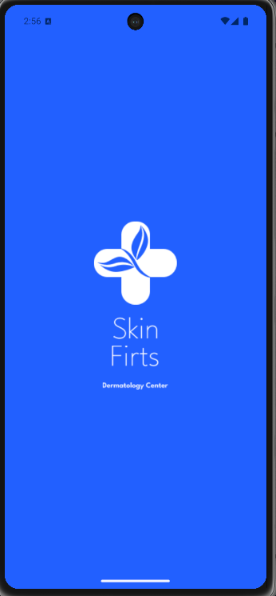 | 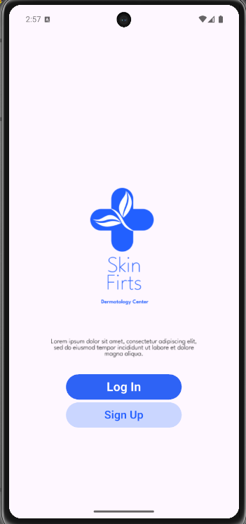 |
Login || Login 2 ||Sign |
| ------------------------------||------------------------------------|| -----------------------------|
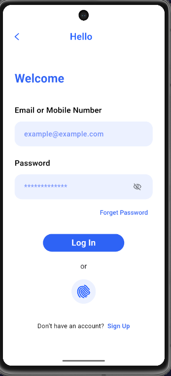 || 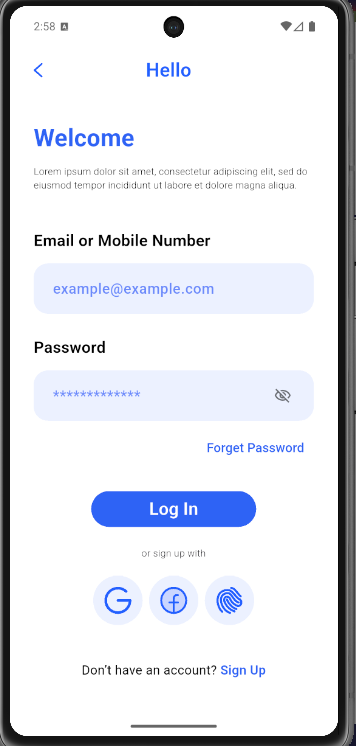 || 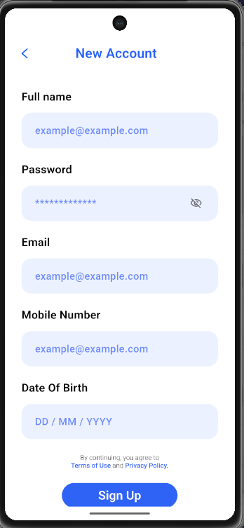|

| Home                          | Doctors                             | Doctor Info                         |
| ----------------------------- | ----------------------------------- | ----------------------------------- |
| 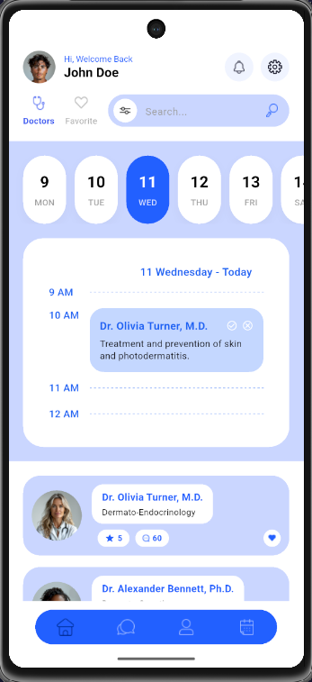 | 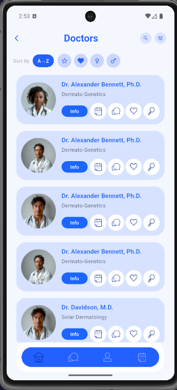 | 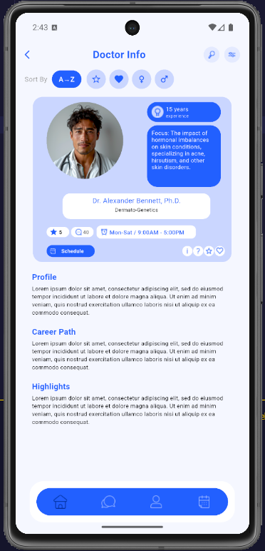 |

| Profile                             | Settings                              | Rating                            |
| ----------------------------------- | ------------------------------------- | --------------------------------- |
| 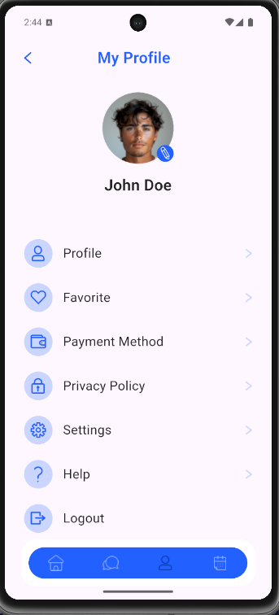 | 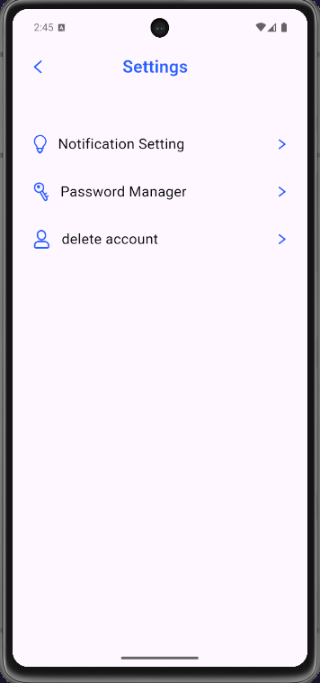 | 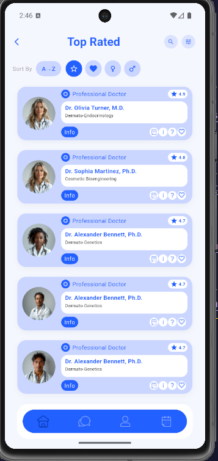 |

| Favorite Doctors                               | Favorite Services                               |
| ---------------------------------------------- | ----------------------------------------------- |
| 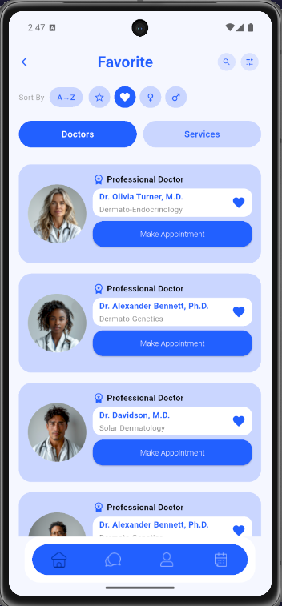 | 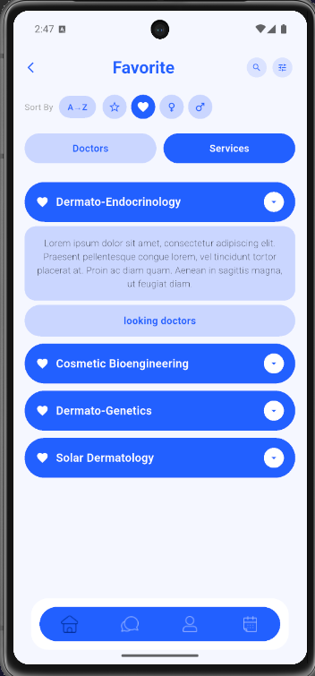 |

| Male                          | Female                            |
| ----------------------------- | --------------------------------- |
| 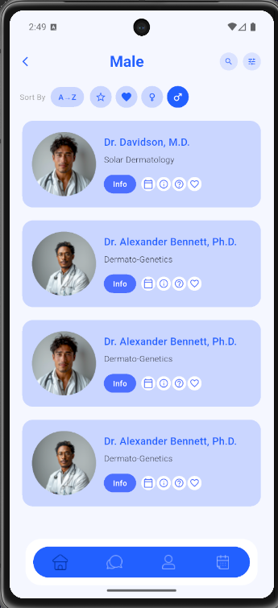 | 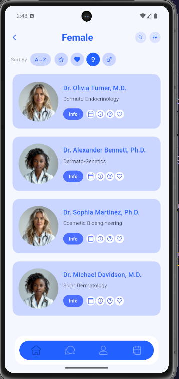 |

---

## 👥 Team

Built with Flutter 💙 by the Medical Health App team.
